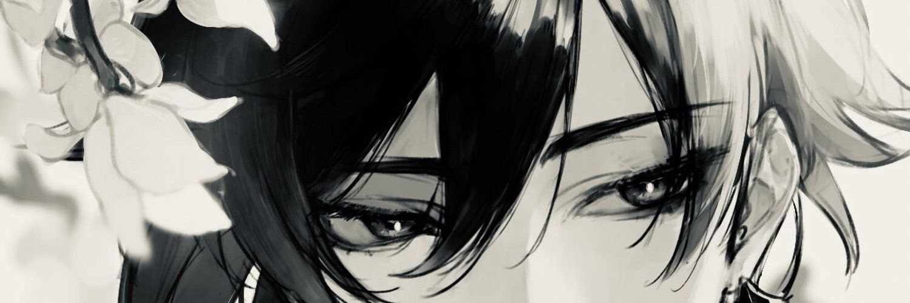

  

<h1 align="center">Hi, I'm Reval 👋</h1>

  🎮 Mahasiswa Teknologi Game @ <strong>PENS</strong>
  
   
  💻 Web & Game Developer | 🧠 Suka Tantangan | 🎯 Unity Enthusiast

  

  

---

## 🚀 Tentang Saya

Halo! Saya Revalino, mahasiswa **Teknologi Game** di **Politeknik Elektronika Negeri Surabaya (PENS)**.

- 🌐 Menguasai **HTML**, **CSS**, **JavaScript**, **PHP**, **Tailwind**, **MySQL**, **Git**, dan **Node.js**
- 🎮 Pengembangan game menggunakan **Unity (C#)**
- 🎨 Bisa desain dengan **Canva** & **Photoshop**
- 🎬 Editing video menggunakan **CapCut**
- 🛠️ Aktif membangun **website pribadi** dan membuat **game-project** di GitHub
- 🔗 Link ke **portfolio website** akan ditambahkan segera

---

## 💡 Rencana & Proyek

- [x] Buat halaman portofolio pribadi
- [x] Integrasi dengan GitHub Pages
- [ ] Buat game mini HTML5 (di `minigame`)
- [ ] Publikasi game Unity pertamaku

---

## 🛠️ Tech Stack

  

---

## 🏆 GitHub Trophy

  

---

## 📊 GitHub Stats

  
  

---

## 🎮 Mini Game: Snake ⭐

> _(Soon! Game HTML5 mini akan tayang di sini)_  
> 🔗 [Klik untuk main](https://Revalino-f.github.io/minigame) _(link aktif nanti setelah di-upload ke GitHub Pages)_

---

## 📫 Contact Me

  
  
  
  

---

  Made with 💙 by Revalino | Proudly from PENS 🚀

<picture>
  <source media="(prefers-color-scheme: dark)" srcset="https://raw.githubusercontent.com/Revalino-f/Revalino-f/output/pacman-contribution-graph-dark.svg">
  <source media="(prefers-color-scheme: light)" srcset="https://raw.githubusercontent.com/Revalino-f/Revalino-f/output/pacman-contribution-graph.svg">
  
</picture>

###
